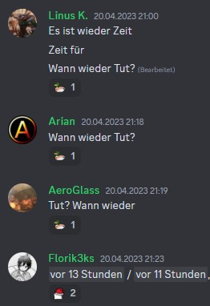

# Studenten in ihrem natürlichen Lebensraum:

  

### Haben Sie genug davon, vergessliche Studenten manuell mit Timestamps des nächsten Tutoriums zu versorgen?
Die GammaSchlange(™️) ist hier, um auf `wann tut` oder `tut wann` automatisiert mit den Timestamps für das nächste Tutorium zu antworten!

In der damit gewonnenen Zeit könnte man ziemlich gut LA lernen! (aber hey, dann wäre das Studium doch viel zu leicht)
